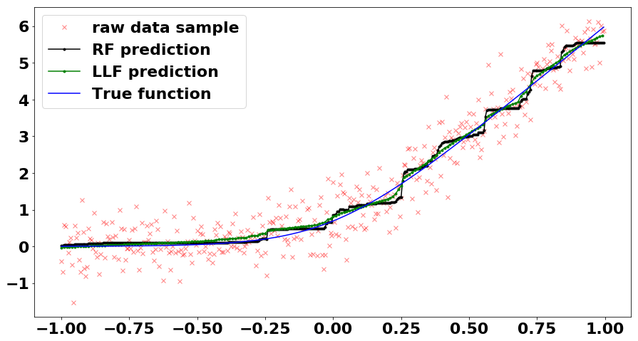

An proof-of-concept implementation of local linear forest. The implementaion followed the [paper by Rina F. et al](https://arxiv.org/abs/1807.11408). 

Python 3.7, two packages were used: sklearn 0.19.2, and numpy 1.15.4. It is built on top of the basic tree structure implemented in sklearn, the efficiency is not optimized in this POC implementation. 

The local linear forest shows some improvement on the "step function" in the ordinary random forest. See [notebook](./notebook/Toy_Example.ipynb)

<

